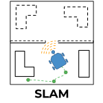
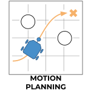
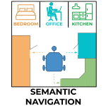
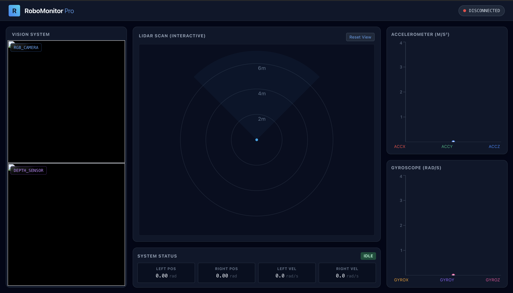
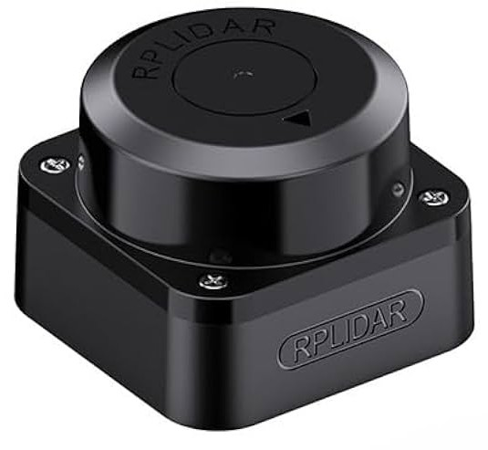
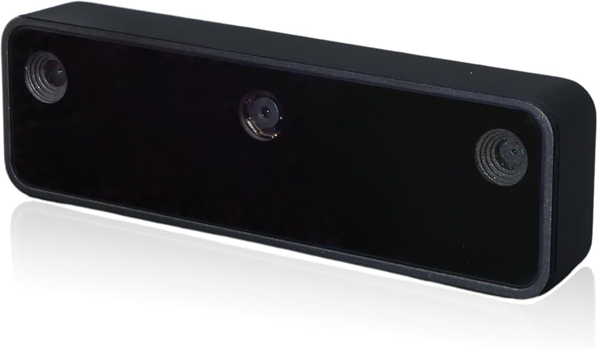
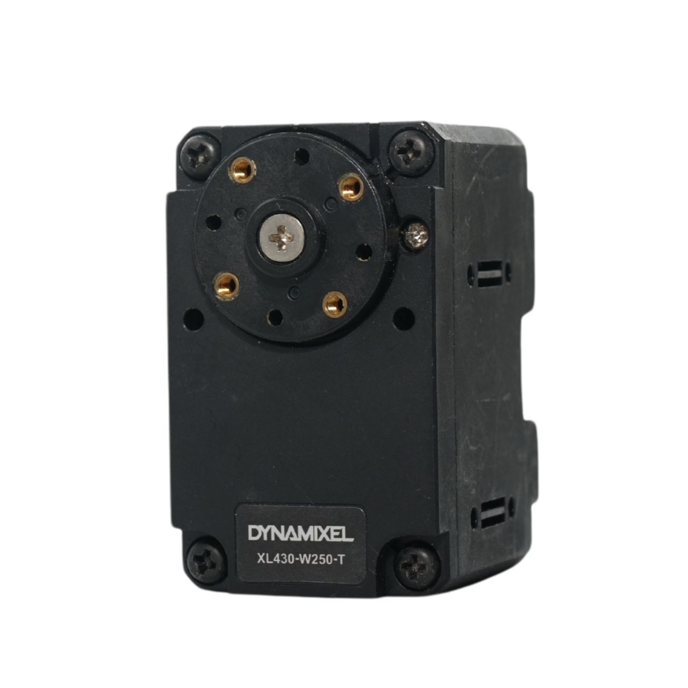

# SunoBot 

<!--  -->

<p align="center">


<p align="center">
SunoBot is an open-source autonomous mobile robot platform meant to explore computer vision, motion planning, and robot design.

## Capabilities:

<p float="center">
  
  
  
</p>

# Monitoring UI - RoboMonitor Pro

The RoboMonitor Pro Monitoring UI allows users to monitor the current readings of all on-board sensors on the SunoBot.

The list of natively monitored sensors:
- Lidar
- RGB Camera
- Depth Camera
- Accelerometer
- Gyroscope

The monitoring UI also includes additional information about the real-time motor positions and velocities.

Example:
<p align="center">

<!-- Insert Example UI Image -->

# Equipped Sensors

## 360 Degree Lidar - RPLidar C1

<p align="center">


<!-- Example Readings -->
<!-- Maybe add gif of lidar readings? -->

### Specifications
- Max Range: 12 meters
- Accuracy: 30 mm
- Angular Resolution: 0.72 degrees

## Stereo Depth Camera - Oak-D Lite

<p align="center">


### Specifications
- Photo Resolution: 13 MP (Auto-Focus Variant)
- Video Resolution: 1080p
- Max Aperture: 2.8 mm
- Angular Resolution: 0.72 degrees
- IMU: 6-axis sensor with accelerometer and gyroscope
- Onboard Compute to run computer vision algorithms and models

<!-- Example Readings -->

<!-- Front on Vision, Depth Camera, 3D Point Cloud -->

# Motors - Dynamixel WL430-XL250-T
<p align="center">



# Code Installation

Requires Python >=3.12.9

```
pip install suno-bot
```

For systems with an Nvidia GPU, you can use the following command to ensure you install torch with cuda to accelerate inference when running local models.

```
pip install suno-bot[cuda]
```

# Build List
| Part | Quantity | Unit Price (USD) | Link |
| --- | --- | --- | --- |
| **Compute** | 
| Nvidia Jetson Nano Orin | 1 | $250 | [Amazon](https://a.co/d/08duLBSw) |
| 128 GB Micro SD Card | 1 | $34 | [Amazon](https://a.co/d/0giFn1uy) |
| **Sensors** |
| RPLidar C1 | 1 | $69 | [Amazon](https://a.co/d/01sqCkox) |
| Luxonis OAK-D Camera | 1 | $170 | [Luxonis](https://shop.luxonis.com/products/oak-d-lite-1?srsltid=AfmBOorUc5neeXpmWIGfSTZnxkuYcXCcGmICYdHt1S2bHc7bLUCkAe_w) |
| **Motors & Accessories** |
| Dynamixel XL-250 | 2 | $27.50 | [Robotis](https://www.robotis.us/dynamixel-xl430-w250-t/?srsltid=AfmBOorzzLew-BFB_joZx9VtZZxa4Z9oEqbe-iFhbOnDY0QIEfWiF8ji) |
| U2D2 | 1 | $36.92 | [Robotis](https://www.robotis.us/u2d2/?srsltid=AfmBOooSLo45Nv1YYB132Rkxfk1DpJbxzMnHwRaMWvsoDXhAL2AbefDP) |
| U2D2 Powerboard | 1 | $21.85 | [Robotis](https://www.robotis.us/u2d2-power-hub-board-set/?srsltid=AfmBOor3gywk-VzFmWBfLSQ8p4dGw5MIHY-m2bNRO97dZFuF4yPFUO9C) | 
| **Power & Accessories** |
| KBT 12V Battery | 1 | $30 | [Amazon](https://a.co/d/07AhwwMU) |
| 8x AA Battery Holder | 1 | $9 | [Amazon](https://a.co/d/021ZlgrT) |
| 20x AA Batteries | 1 | $10 | [Amazon](https://a.co/d/07lIH3iI) |
| USB C to USB A Cable | 1 | $7 | [Amazon](https://a.co/d/0gSawx84) |
| **Assembly Hardware** |
| Turtle Bot 3 Wheel and Tire Kit (2 Pack) | 1 | $10.81 | [Robotis](https://www.robotis.us/tb3-wheel-tire-set-isw-01-2ea/?srsltid=AfmBOoqbfCWowxFdXaFuWtPJexun5_ZJ9yr--zFMI7q9_nNrtQws9ymt) |
| Turtle Bot 3 Casters | 2 | $4.03 | [Robotis](https://www.robotis.us/tb3-ball-caster-a01-1ea/?srsltid=AfmBOoqPqs-xQAHIdZojc0kwzRB7mlPQLGsexGX9tZXpylSCpcbwvvi0) |
| Screw Pack | 1 | $9 | [Amazon](https://a.co/d/002Dz5YJ) |
| Standoffs | 1 | $10 | [Amazon](https://a.co/d/06RelOfa) |
| **Total** | --- | $730.64 | --- |


# Chassis & Brackets - 3D Printed Parts
| Part | Quantity | CAD File |
| --- | --- | --- |
| Base Board | 2 | [Link](./CAD/Robot%20Base%20Plate.stl) |
| Motor Mounts | 2 | [Link](./CAD/430T%20Motor%20Mounts.stl) |
| Sensor Mounting Bracket Riser | 1 | [Link](./CAD/Lidar%20Mounting%20Plate%20Wide.stl) |
| Jetson Mount | 1 | [Link](./CAD/Jetson%20Mount.stl) |
| Jetson Securing Bracket | 1 | [Link](./CAD/Jetson%20Securing%20Bracket.stl) |
| Camera Mounting Bracket | 1 | [Link](./CAD/Camera%20Mounting%20Bracket.stl) |
| Camera Mounting Bracket Spacer | 1 | [Link](./CAD/OAK-D%20Lite%20Camera%20Mount.stl) |
| Lidar Mounting Bracket | 1 | [Link](./CAD/Lidar%20Mounting%20Plate.stl) |
| KBT Battery Holder | 1 | [Link](./CAD/KBT%20Battery%20Holder.stl) |
| AA Battery Holder | 1 | [Link](./CAD/8%20AA%20Battery%20Holder%20Horizontal.stl) |

### Printer
Any 3D printer large enough should work to print all of these parts. For reference, I printed these parts using a Prusa MK4S printer with PLA and got fairly decent results.

# Assembly Instructions
Please follow this tutorial for instructions on how to assemble the SunoBot.

# Getting Started Guide

# Future Plans
ROS Integration

# Technology Stack

<p float="center">
  
  
  
  
  
  
  
  
  
  
  
  
</p>
